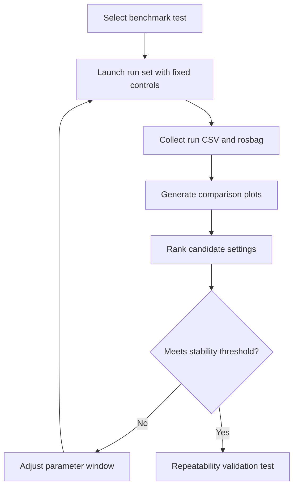
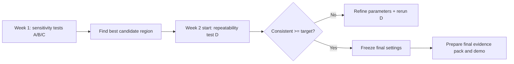

# PaDy Project Status (6 Mar 2026)

## 1) Honest status vs last meeting notes

### What is achieved
- Passive-arm architecture is now enforced in launch/bridge flow.
- Testing pipeline is working end-to-end:
  - run data logging (`analysis.launch.py` + `gait_analyser.py`)
  - repeatable headless runs
  - CSV-based plotting 
- Benchmark comparisons were executed and plotted:
  - slope comparison (3.00 / 3.25 / 3.50 deg)
  - spawn pitch comparison
  - kick torque comparison
- Metric misunderstanding was identified and corrected:
  - `step_count` in CSV is signal-level (zero-crossing) and not direct footfall count.
- Current realistic performance: **best observed = 2 consecutive passive steps**.

### What is not achieved yet
- 5 consecutive passive steps is **not yet achieved**.
- No validated cost/gain objective has been finalized for optimization (energy per step still approximate).
- Stability definition is still informal; acceptance thresholds are not finalized.
- C.O.G./COM tracking over gait cycle is not yet implemented as a dedicated metric output.
- Design-space testing beyond parameter tuning (major geometry/mass design variants) is still limited.

---

## 2) Critical fail-states understood (current)

1. **Early forward collapse** (insufficient or poorly timed initiation energy).
2. **Side-fall / yaw drift** (lateral stability and foot-ground interaction limits).
3. **Step-to-step inconsistency** (parameters produce occasional good run but poor repeatability).

Current root challenge: move from occasional 2–3 step behavior to reliable repeatability.

---

## 3) 4 detailed tests for next phase (realistic)

## Test A — Slope sensitivity benchmark
- Variable: slope angle (3.00 / 3.25 / 3.50 deg)
- Hold constant: kick, pitch, body force, timing
- Runs: 3–5 repeats per angle (9–15 runs)
- Duration: ~1.5 to 2.5 hours total
- Shows:
  - whether gravity drive is insufficient/excessive
  - which slope band maximizes stable progression

## Test B — Spawn pitch sensitivity benchmark
- Variable: spawn pitch (e.g., 0.24 / 0.275 / 0.31)
- Hold constant: slope, kick, body force, timing
- Runs: 3–5 repeats per pitch (9–15 runs)
- Duration: ~1.5 to 2.5 hours total
- Shows:
  - dependence on initial condition
  - robustness of basin of attraction for first 2–3 steps

## Test C — Actuation gain benchmark (kick torque)
- Variable: kick torque (e.g., 24 / 30 / 36)
- Hold constant: slope, pitch, body force, timing
- Runs: 3–5 repeats per level (9–15 runs)
- Duration: ~1.5 to 2.5 hours total
- Shows:
  - under-drive vs over-drive boundary
  - parameter region most likely to extend steps

## Test D — Repeatability / stability validation
- Variable: none (fix best candidate from A/B/C)
- Runs: 15–20 repeats
- Duration: ~2 to 3 hours
- Shows:
  - true repeatability
  - whether result is robust enough for final demonstration

---

## 4) Quantified performance measures (current vs needed)

### Available now
- Step progression (`step_count` signal in CSV)
- Gait period signal (`gait_period_s`)
- Hip symmetry (`hip_symmetry_rad`)
- Height signal (`base_height_m` / projected height in newer analyser)

### Needed to finalize
- **Energy-per-step objective (cost/gain):**
  - candidate approximation: $(\text{input work proxy}) / (\text{physical steps})$.
- **COM/C.O.G. metric:**
  - add logged COM projection relative to support region (or surrogate using base pose + mass model).

---

## 5) Software/platform decision (and alternatives)

## Considered alternatives
- MATLAB/Simulink + Simscape Multibody
- PyBullet
- Webots
- MuJoCo

## Why ROS 2 + Gazebo + RViz was chosen
- Native robotics workflow and publish/subscribe architecture.
- Easy logging + replay (`rosbag`) and structured topic instrumentation.
- Flexible scripting for rapid experiment automation.
- Strong fit with final-year robotics demonstration expectations.

## Current shortcomings of chosen stack
- Contact tuning can be sensitive and non-intuitive.
- Step metric semantics required correction (signal vs physical step interpretation).
- Requires explicit validation layer for repeatability and metric integrity.

---

## 6) Flowcharts (for presentation)

## Experiment workflow

## Final 1.5-week execution logic

---

## 7) Immediate next actions (priority)

1. Freeze one baseline configuration file/command to avoid hidden drift.
2. Run Test D-style repeatability on current best candidate (15+ runs).
3. Add one derived metric script output: estimated physical steps per run.
4. Define and document final stability acceptance criteria (numeric thresholds).
5. If repeatability remains poor, prioritize contact + pitch + kick interaction before new geometry redesign.

---

## 8) Bottom-line statement for supervisor

- Progress is real: pipeline, data, and benchmark method are now in place and producing interpretable outputs.
- Limitation is also clear: performance is currently capped at ~3 passive steps.
- The remaining work is not “build from scratch”; it is targeted convergence and repeatability validation to reach 5-step stability.
